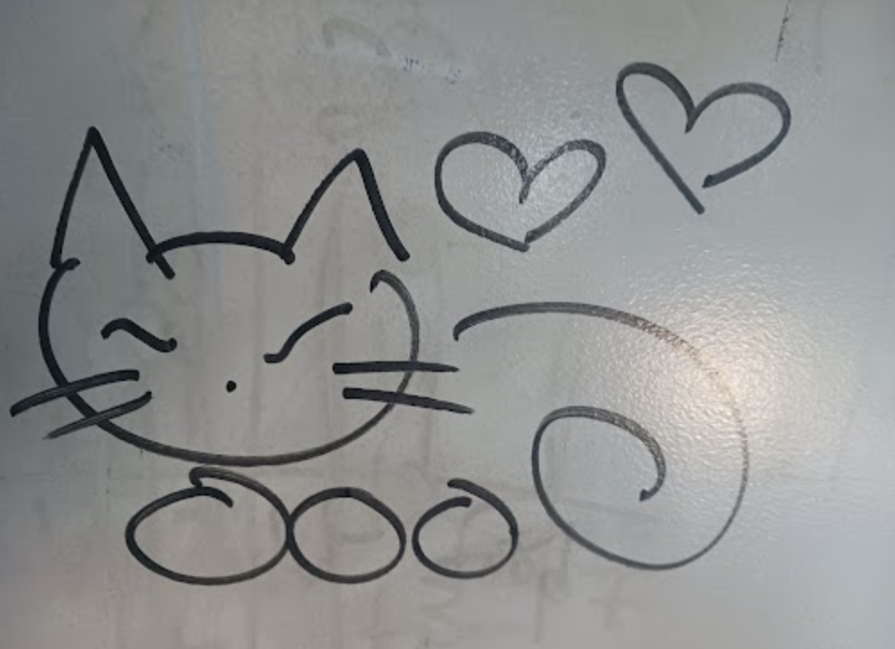

# Project Proposal

1. Roughly, what will your drawing look like

i will draw a cat

2. What are two variables you could use so that when you change each variable, the drawing changes?

size of the hearts - they can be bigger or smaller

size of the cat - the cat can be bigger or smaller

3. Where is there repetition in your drawing?

there's a bunch of whiskers
there are 2 hearts
there are 3 paws
there are 2 eyes
there are 2 ears

4. What are the main parts of your drawing? Are there clear sections or objects?

cat
  - head
  - body

hearts 
  - two hearts

5. How could you use a loop variable of a for loop? Is there somewhere in your drawing where something is repeated, but it's slightly different each time? Maybe the same object is repeated in different places, or maybe a similar object is repeated but with different sizes?

i can make the hearts slightly different sizes

all the other repetition, i can draw stuff in different locations
